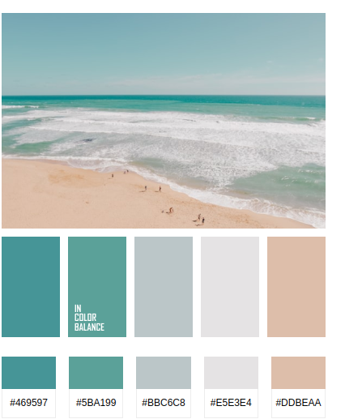

# Nombre del Proyecto

Delpliegue de ejmplos para realizar ejercicios prácticos

Se aportan enunciados, ejecucion y con la posibilidad de aportar  posibles soluciones

Existe una opción de administración para subier, organizar y administrar cada ejercicio de forma sencilla

Está basado en una estrucutra de ficheros dónde se ubicarán los ejericicos (enunciado, ejecución y soluciones)

## Comenzando

Estas instrucciones te permitirán obtener una copia del proyecto en funcionamiento en tu máquina local para propósitos de desarrollo y pruebas.

### Prerrequisitos

Lo que necesitas para instalar el software y cómo instalarlo:

[//]: # (TODO) Pediente

### Instalación

[//]: # (TODO) Pediente

git clone https://github.com/tu_usuario/tu_proyecto.git
cd tu_proyecto
composer install

r
Copy code

## Uso

Instrucciones sobre cómo utilizar la aplicación, incluyendo ejemplos de código si es aplicable.

php artisan serve

csharp
Copy code

Accede a `http://localhost:8000` en tu navegador para ver la aplicación en acción.

## Ejecutando las pruebas

Explica cómo ejecutar las pruebas automatizadas para este sistema.

php artisan test

markdown
Copy code

## Despliegue

Notas adicionales sobre cómo desplegar esto en un sistema en vivo.

## Construido con

* [Laravel](https://laravel.com) - El framework web usado
* [Vue.js](https://vuejs.org) - Front-end
* [Tailwind CSS](https://tailwindcss.com) - Utilizado para el diseño

## Contribuir

Por favor, lee [CONTRIBUTING.md](https://github.com/tu_usuario/tu_proyecto/CONTRIBUTING.md) para detalles sobre nuestro código de conducta, y el proceso para enviarnos pull requests.

## Versionado

Usamos [SemVer](http://semver.org/) para el versionado. Para las versiones disponibles, vea las [tags en este repositorio](https://github.com/tu_usuario/tu_proyecto/tags).

## Autores

* **Tu Nombre** - *Trabajo Inicial* - [tu_usuario](https://github.com/tu_usuario)

Ver también la lista de [contribuyentes](https://github.com/tu_usuario/tu_proyecto/contributors) que participaron en este proyecto.

## Licencia

Este proyecto está licenciado bajo la Licencia XYZ - vea el archivo [LICENSE.md](LICENSE.md) para detalles.

## Agradecimientos

* Agradecimiento a quien corresponda.
* Inspiración.
* etc.

# Paleta de colores

#469597
#5BA199
#BBC6C8
#E5E3E4
#DDBEAA
